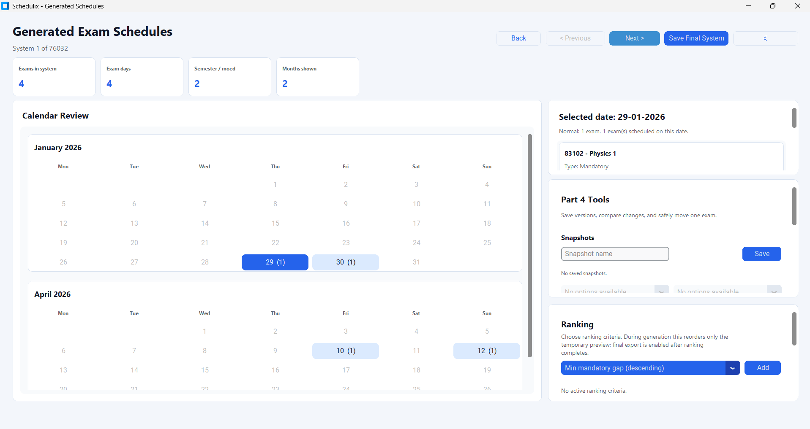
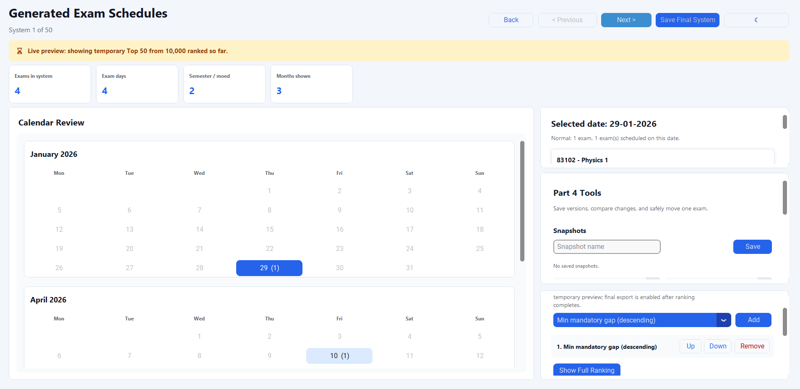
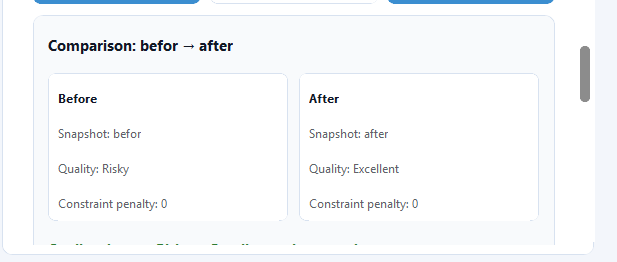
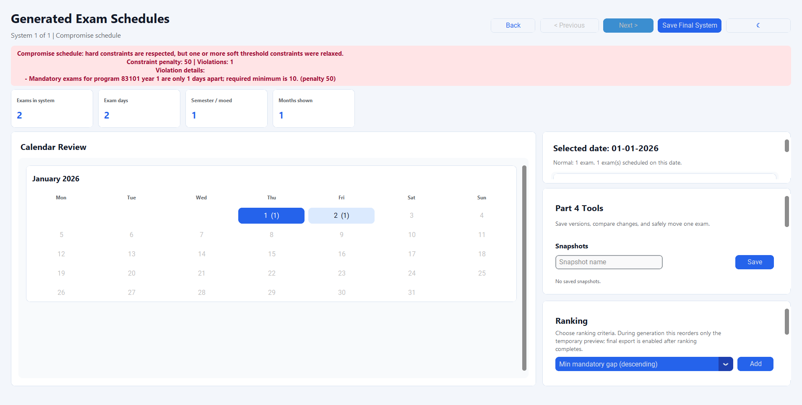

# Schedulix

Schedulix is an exam schedule generation and decision-support system. It
loads course, program, and exam-period data, generates valid exam schedules,
ranks alternatives, and helps users review and improve schedules through a
desktop GUI.

The project supports strict schedule generation, progressive ranked
alternatives, manual exam movement, snapshots, snapshot comparison, impact
analysis, output reports, and fallback compromise schedules when no fully valid
schedule exists.

## Key Features

| Area | What Schedulix Supports |
| --- | --- |
| Input workflow | File-based loading of courses, selected programs, exam periods, and optional settings |
| GUI workflow | Upload, program selection, settings, date management, generation, review, ranking, editing, and export |
| Strict generation | Generates all schedules that satisfy the selected hard and threshold constraints |
| Ranking | Progressive Top 50 preview while ranking continues, plus full ranked browsing after completion |
| Manual editing | Move one exam to another valid date and inspect the impact |
| Snapshots | Save/load named schedule versions |
| Comparison | Compare snapshots by quality, constraint penalty, and moved exams |
| Fallback | Show best-effort compromise schedules when strict generation returns zero valid schedules |
| CLI/service flow | Run the scheduler from the file-based application entry point |

## Quick Start

From the project root:

```powershell
python -m venv .venv
.\.venv\Scripts\Activate.ps1
pip install -r requirements.txt
```

Run the GUI:

```powershell
$env:PYTHONPATH = "src"
python -m gui.workflow.mainGui
```

Run the file-based example flow:

```powershell
.\.venv\Scripts\python.exe src\main.py
```

## Running Tests

Run the full suite:

```powershell
.\.venv\Scripts\python.exe -m pytest
```

Useful focused checks:

```powershell
.\.venv\Scripts\python.exe -m pytest tests\unit\gui_tests\test_quality_improvement_demo.py
.\.venv\Scripts\python.exe -m pytest tests\unit\gui_tests\test_upload_service.py
.\.venv\Scripts\python.exe -m pytest tests\unit\scheduling_tests\test_progressive_ranking_flow.py
```

## Official Demo Data

The presentation-ready demo data is under [data/examples](data/examples/README.md).

| Demo | Purpose | Detailed Guide |
| --- | --- | --- |
| `basic_course_example` | Normal generation over a large schedule universe and progressive ranking | [Guide](data/examples/basic_course_example/README.md) |
| `quality_snapshot_demo` | Manual move, snapshots, and Risky to Excellent comparison | [Guide](data/examples/quality_snapshot_demo/README.md) |
| `fallback_compromise_demo` | No strict solution, compromise prompt, and penalty explanation | [Guide](data/examples/fallback_compromise_demo/README.md) |

Each demo folder contains `programs.txt`, `courses.txt`, `dates.txt`,
`settings.txt`, and its own `README.md`. When the three input files are chosen
from the same folder, the GUI preloads the colocated `settings.txt`
automatically before the scheduling settings screen. The user can still edit
settings manually afterward.

## Live Demo Flows

### 1. Basic Generation

Use `data/examples/basic_course_example/` to show the normal scheduling flow.
The expected result is about `76,032` valid schedules. In normal mode,
Schedulix exposes all generated schedules; Top 50 is used only when ranking is
explicitly started.



### 2. Progressive Ranking

From the generated basic example, add ranking criteria. Schedulix shows a
temporary Top 50 preview while ranking continues, then lets the user show the
full ranked result.



### 3. Snapshot Quality Improvement

Use `data/examples/quality_snapshot_demo/` to show manual schedule editing:
save `before`, move `83102 - Data Structures` from `02-01-2026` to
`08-01-2026`, save `after`, and compare. The quality improves from
`Risky` to `Excellent`.



### 4. Fallback Compromise Schedule

Use `data/examples/fallback_compromise_demo/` to show the fallback path. Strict
generation finds no fully valid schedule because the mandatory gap requirement
is impossible. The GUI offers compromise schedules that still respect hard
constraints and explains the soft-constraint penalty.



## Project Structure

```text
Schedulix/
|-- src/
|   |-- application/       # App orchestration, cache, validation, commands
|   |-- fileReader/        # Input file readers and settings parser
|   |-- gui/               # Screens, presenters, services, workflow shell
|   |-- output/            # Schedule export and diff report writers
|   |-- scheduling/        # Generation, constraints, ranking, snapshots, edits
|   |-- constraint_settings.py
|   |-- ranking_settings.py
|   |-- models.py
|   `-- main.py
|-- tests/
|   |-- unit/
|   |-- integration/
|   `-- system/
|-- data/
|   |-- examples/          # Three official demo datasets
|   `-- outputs/           # Generated schedule/report output
|-- images/                # README screenshots
`-- requirements.txt
```

## Architecture Notes

Schedulix follows a layered structure:

```text
GUI Screens -> Presenters -> Services -> Scheduling Domain -> File/Output Layer
```

- GUI screens focus on layout and widget events.
- Presenters coordinate view state and user actions.
- `SchedulingService` coordinates filtering, generation, ranking, fallback,
  and cache updates.
- Constraint, ranking, snapshot, manual-edit, and comparison logic live under
  `src/scheduling`.
- File parsing stays under `src/fileReader`; output formatting stays under
  `src/output`.

## Notes and Limitations

- Screenshots and example data are optimized for the official live demo flows.
- Fallback schedules are compromise schedules: they respect hard constraints
  but relax enabled soft threshold constraints and show a penalty explanation.
- `settings.txt` auto-preload works when `programs.txt`, `courses.txt`, and
  `dates.txt` are selected from the same demo folder.
- Detailed demo instructions live in the three demo README files linked above.
