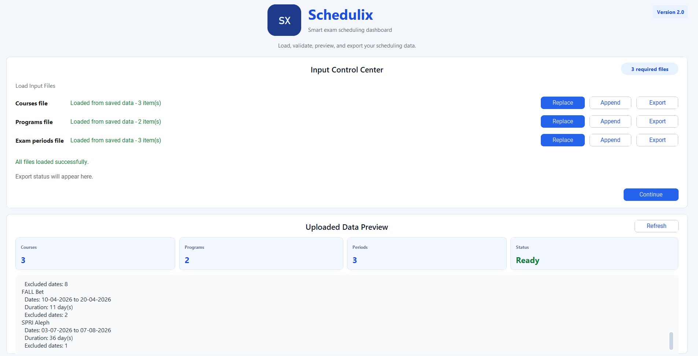
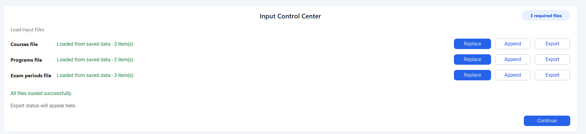
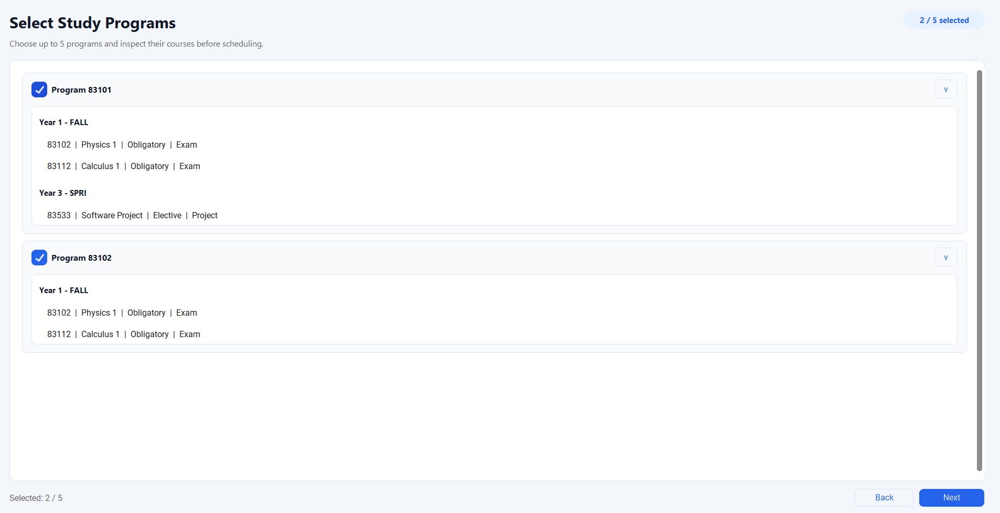
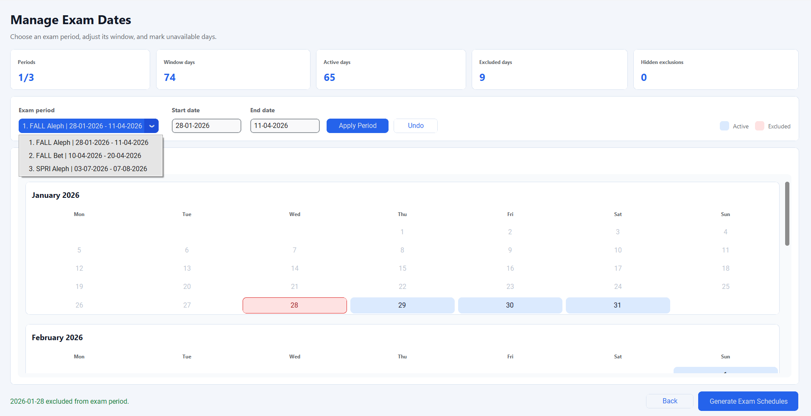
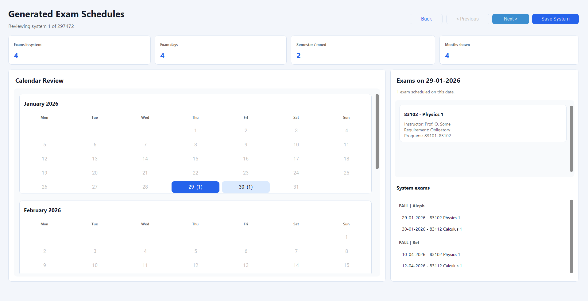

# Schedulix

Schedulix is a Python desktop and file-based exam scheduling system. It reads
course data, selected study programs, exam-period windows, unavailable dates,
optional scheduling constraints, and optional ranking preferences. It then
generates valid exam-system alternatives, ranks them, previews the best results,
and lets the user review, edit, compare, and export schedules.

The current project version includes the Version 34 scheduling work:

- configurable threshold constraints for valid schedules;
- ranking and optimization criteria for valid schedules;
- progressive batch generation with a bounded Top-N preview;
- schedule snapshots, manual editing, impact analysis, and comparison reports;
- a customTkinter GUI workflow plus a simpler file-based CLI flow;
- unit, integration, and system tests for the main workflows.

## Current User Workflows

Schedulix supports two practical entry points.

### GUI Workflow

The GUI is the main user-facing workflow. It guides the user through uploading
data, selecting programs, configuring scheduling settings, editing exam dates,
generating schedules, reviewing ranked results, and exporting the selected
schedule.

```text
Upload Files -> Select Programs -> Scheduling Settings -> Manage Exam Dates -> Generate Schedules -> Review Results
```

The GUI runs scheduling work away from the direct screen logic so the interface
can stay responsive during heavier generation runs.

### File-Based CLI Workflow

The CLI flow is useful for quick checks, automated tests, and simple example
runs. It reads the default files under `data/examples/`, runs the shared
scheduling services, and writes a readable schedule output file.

## Version 34 Highlights

Version 34 is focused on making schedule generation more useful and more
reviewable, not only on producing any valid schedule.

### 1. New Scheduling Constraints

The scheduling engine supports five configurable threshold constraints:

| Constraint | Meaning |
| --- | --- |
| `mandatory_gap_days` | Requires a minimum gap between related mandatory exams. |
| `any_course_gap_days` | Requires a minimum gap between any related course exams. |
| `elective_conflicts_per_program` | Limits elective same-day conflicts per program. |
| `mandatory_span_days` | Limits the total date span of mandatory exams. |
| `max_exams_per_day` | Limits how many exams can be scheduled on the same day. |

The settings are represented by `SchedulingConstraintSettings` in
`src/constraint_settings.py` and enforced through the constraint registry in
`src/scheduling/constraints.py`.

### 2. Ranking and Optimization

Valid schedules can be ranked by a priority list of optimization criteria:

| Ranking Criterion | Meaning |
| --- | --- |
| `min_mandatory_gap` | Prefer schedules with larger minimum mandatory gaps. |
| `average_all_gap` | Prefer schedules with better average spacing. |
| `elective_collision_count` | Prefer fewer elective collisions. |
| `mandatory_span` | Prefer a better mandatory exam span. |
| `max_exams_per_day` | Prefer a lower daily load. |

Ranking settings live in `src/ranking_settings.py`. Metric calculation is
handled by `src/scheduling/scheduleMetricsCalculator.py`, ordering by
`src/scheduling/scheduleRanker.py`, and orchestration by
`src/scheduling/scheduleRankingService.py`.

### 3. Progressive Top-N Preview

The progressive generation flow avoids waiting until every possible schedule is
generated before the user sees useful results.

```text
lazy generator -> batches -> ranking -> Top-N buffer -> snapshot -> GUI
```

Important files:

- `src/scheduling/schedulingService.py`
- `src/scheduling/progressiveGeneration.py`
- `src/scheduling/rankedResultsBuffer.py`
- `src/scheduling/scheduleRankingService.py`
- `src/gui/presenters/schedulingPresenter.py`

The key design choice is that the system keeps only a bounded ranked preview
instead of storing every generated schedule during preview. This protects memory
and responsiveness while still showing the strongest schedules found so far.

### 4. Snapshots, Manual Editing, and Comparison

After schedules are generated, the project supports user-centered review tools:

- save named schedule snapshots;
- manually move an exam date on a copied schedule;
- validate the edited schedule against active constraints;
- analyze the impact of a move;
- compare two snapshots;
- export a readable diff report.

Important files:

- `src/scheduling/scheduleSnapshot.py`
- `src/scheduling/manualScheduleEditor.py`
- `src/scheduling/impactAnalysisService.py`
- `src/scheduling/scheduleDiffService.py`
- `src/output/diffReportWriter.py`

This feature is important because it turns the scheduler from a one-shot
generator into an interactive decision-support tool.

## Screenshots

### Upload Files



The upload screen loads courses, study programs, and exam periods. The user can
replace or append data and preview the loaded state before continuing.



### Select Programs



The program selection screen lets the user choose up to five study programs and
inspect the courses connected to those programs.

### Manage Exam Dates



The date management screen lets the user inspect exam-period windows, exclude
unavailable dates, undo changes, and start schedule generation.

### Review Results



The results screen shows generated schedule alternatives and highlights the
selected schedule in a calendar-style view.


## Architecture Overview

Schedulix is organized around a lightweight layered architecture.

```text
GUI Screens
    |
Presenters
    |
Application and Scheduling Services
    |
Domain Scheduling, Constraints, Ranking, Snapshots
    |
Models, File Readers, Output Writers
```

The GUI screens are intentionally kept close to view logic. Presenters convert
user actions into service calls. Scheduling services coordinate the generation,
constraint, ranking, and cache workflows. Domain modules hold the scheduling
logic and are tested independently.

### Core Design Patterns

- **MVP-style GUI separation:** screens render UI, presenters coordinate user
  actions and service calls.
- **Service Layer:** `SchedulingService` coordinates filtering, generation,
  ranking, buffering, and cache updates.
- **Strategy/Registry style constraints:** constraints are configured and
  evaluated through a central registry.
- **Batch processing:** generated schedules are processed in batches for
  progressive preview.
- **Bounded buffer:** `RankedResultsBuffer` keeps only the current Top-N ranked
  schedules.
- **Immutable result objects:** many workflow results use dataclasses to make
  state transitions easier to test and reason about.
- **Snapshot pattern:** saved schedules are copied so later edits do not mutate
  earlier versions.

## Project Structure

```text
Schedulix/
|-- data/
|   |-- examples/                    # Example input files
|   `-- outputs/                     # Generated output files
|-- images/                          # README screenshots
|-- src/
|   |-- main.py                      # CLI entry point
|   |-- models.py                    # Course, ProgramEnrollment, ExamPeriod
|   |-- constraint_settings.py       # Threshold constraint configuration
|   |-- ranking_settings.py          # Ranking criteria, metrics, ranked wrapper
|   |-- application/
|   |   |-- schedulixApp.py          # File-based app orchestration
|   |   |-- cache_manager.py         # GUI/app state cache
|   |   |-- settings_validator.py    # Constraint/ranking validation
|   |   |-- commands.py              # Undo/redo command support
|   |   `-- async_runner.py          # Background task helper
|   |-- fileReader/
|   |   |-- baseFileReader.py
|   |   `-- fileTypeReaders/         # Courses, programs, periods, settings
|   |-- gui/
|   |   |-- workflow/                # GUI app shell and navigation
|   |   |-- screens/                 # customTkinter screens
|   |   |-- presenters/              # Testable presenter logic
|   |   |-- services/                # GUI-facing upload/export services
|   |   `-- factories/               # View and presenter factories
|   |-- output/
|   |   |-- outputWriter.py          # Writes generated schedules
|   |   |-- exportService.py         # Exports selected schedules
|   |   `-- diffReportWriter.py      # Writes snapshot comparison reports
|   `-- scheduling/
|       |-- examScheduleGenerator.py       # Constraint-aware schedule generation
|       |-- schedulingService.py           # Main scheduling use-case service
|       |-- constraints.py                 # Threshold constraint evaluation
|       |-- batchIterator.py               # Batch helper for generated schedules
|       |-- progressiveGeneration.py       # Progressive result state models
|       |-- rankedResultsBuffer.py         # Bounded Top-N preview buffer
|       |-- scheduleRankingService.py      # Metric calculation + ranking flow
|       |-- scheduleMetricsCalculator.py   # Ranking metric calculation
|       |-- scheduleRanker.py              # Ranking comparator/order logic
|       |-- scheduleSnapshot.py            # Named schedule snapshots
|       |-- manualScheduleEditor.py        # Safe manual exam movement
|       |-- impactAnalysisService.py       # Impact summary for edits
|       |-- scheduleDiffService.py         # Snapshot comparison
|       |-- qualityTagCalculator.py        # Quality labels for schedules
|       |-- scheduleIntrospection.py       # Schedule traversal/copy helpers
|       |-- courseFilter.py
|       |-- examDateHandler.py
|       |-- examConflictDetector.py
|       `-- dayLoadAnalyzer.py
`-- tests/
    |-- unit/
    |-- integration/
    `-- system/
```

## How To Run

### 1. Install Dependencies

From the project root:

```powershell
cd C:\Users\user\Desktop\Schedulix
python -m venv .venv
.\.venv\Scripts\python.exe -m pip install -r requirements.txt
```

The project currently depends on:

```text
customtkinter==5.2.2
pytest==9.0.3
```

### 2. Run the GUI

```powershell
cd C:\Users\user\Desktop\Schedulix
$env:PYTHONPATH="src"
.\.venv\Scripts\python.exe -m gui.workflow.mainGui
```

### 3. Run the CLI Example Flow

```powershell
cd C:\Users\user\Desktop\Schedulix
.\.venv\Scripts\python.exe .\src\main.py
```

A successful CLI run prints a summary similar to:

```text
Schedulix run completed successfully.
Selected programs: 3
Courses read: 3
Relevant Exam courses: 2
Exam periods read: 3
Valid exam systems: 76032
Active constraints: none
Active ranking criteria: none
Output file: C:\Users\user\Desktop\Schedulix\data\outputs\exam_schedules.txt
Runtime seconds: 1.42
```

The default output file is:

```text
data/outputs/exam_schedules.txt
```

## Input Files

The default example inputs are:

```text
data/examples/CourseExample.txt
data/examples/DatesExample.txt
data/examples/ProgramsExample.txt
data/examples/SettingsExample.txt
data/examples/commands.txt        # Optional, user-created command file
```

The settings file is optional. If it is not supplied, all threshold constraints
are disabled and ranking is not applied. The command file is also optional and
is only used by the file-based flow when `commands_path` is supplied.

### Selected Programs File

Example:

```text
83101, 83102, 83108
```

Rules:

- up to five programs;
- every program ID must be five digits;
- only supported program IDs are accepted.

### Courses File

Each course record starts with `$$$$`.

```text
$$$$
Course name
Course number
Instructor name
Program,Year,Semester,Requirement
Program,Year,Semester,Requirement
Evaluation
```

Example:

```text
$$$$
Physics 1
83102
Prof. O. Some
83101,1,FALL,Obligatory
83102,1,FALL,Obligatory
Exam
```

Rules:

- course numbers and program IDs must be five digits;
- year must be `1`, `2`, `3`, or `4`;
- semester must be `FALL`, `SPRI`, or `SUMM`;
- requirement must be `Obligatory` or `Elective`;
- evaluation must be `Exam`, `Project`, or `Attendance`;
- only courses with `Exam` are scheduled.

### Exam Periods File

Each exam-period record starts with `$$$$`.

```text
$$$$
Semester, Moed
Start date, End date
Excluded date optional comment
Excluded start date, Excluded end date optional comment
```

Example:

```text
$$$$
FALL, Aleph
29-01-2026, 11-03-2026
- 31-01-2026 Shabat
- 02-03-2026, 04-03-2026 Purim
```

Rules:

- dates use `DD-MM-YYYY`;
- semester must be `FALL`, `SPRI`, or `SUMM`;
- moed must be `Aleph`, `Bet`, or `Gimel`;
- excluded dates can be single dates or date ranges;
- comments after excluded dates are ignored by the scheduler.

### Scheduling Settings File

The optional settings file configures Version 34 constraints and ranking.

```text
# Constraint lines:
# <constraint_type> = <enabled>, <k>
mandatory_gap_days             = on,  3
any_course_gap_days            = off, 0
elective_conflicts_per_program = off, 0
mandatory_span_days            = off, 0
max_exams_per_day              = on,  2

# Ranking criteria in priority order:
ranking: min_mandatory_gap
ranking: average_all_gap : desc
```

Supported constraint names:

```text
mandatory_gap_days
any_course_gap_days
elective_conflicts_per_program
mandatory_span_days
max_exams_per_day
```

Supported ranking criteria:

```text
min_mandatory_gap
average_all_gap
elective_collision_count
mandatory_span
max_exams_per_day
```

### File-Based Commands File

The optional commands file extends the CLI flow with Part 4 snapshot and manual
editing actions. It is parsed by `CommandsFileReader` and can be passed to:

```python
SchedulixApp().run(commands_path="data/examples/commands.txt")
```

Supported commands:

```text
SAVE_SNAPSHOT SnapA
MOVE 83110 TO 03-02-2026
SAVE_SNAPSHOT SnapB
LOAD_SNAPSHOT SnapA
COMPARE SnapA SnapB
```

Rules:

- blank lines and `#` comments are ignored;
- `MOVE` changes one course date in the active schedule;
- `SAVE_SNAPSHOT` stores the current schedule in memory under a name;
- `LOAD_SNAPSHOT` restores a saved snapshot;
- `COMPARE` writes a `diff_report.txt` file with only changed course dates and
  penalty-score delta when available.

## Output Format

The output begins with a title, settings summary, valid-system count, and then
the generated schedule options.

```text
Schedulix Exam Schedules
========================================
Settings: constraints[mandatory_gap_days=3, max_exams_per_day=2] | ranking[min_mandatory_gap desc, average_all_gap desc]
Valid systems: 12
========================================

Schedule 1
========================================
Metrics: min_gap=3 | avg_gap=5.0 | elective_collisions=0 | mand_span=2 | max_per_day=1
Quality: Good - balanced schedule with manageable spacing and load
Semester: FALL
Moed: Aleph
29-01-2026 | Physics 1 | Prof. O. Some
30-01-2026 | Calculus 1 | Dr. Erez Scheiner
```

Each `Schedule N` represents one complete exam-system option. If ranking is
active, schedules are ordered by the selected ranking criteria. If ranking is
inactive, schedules remain in generation order. The `Quality:` line summarizes
schedule quality from the calculated metrics or penalty score.

## Conflict Rule

Two exams are a critical conflict when:

- they are scheduled on the same date;
- they belong to the same program;
- they belong to the same year;
- they are not both elective courses.

This base conflict rule works together with the optional Version 34 threshold
constraints.

## Important Files for Code Review

If you are preparing for an academic code review, these files are the strongest
starting points:

| File | Why it matters |
| --- | --- |
| `src/scheduling/schedulingService.py` | Main Version 34 orchestration: generation, ranking, buffering, snapshots, and cache updates. |
| `src/scheduling/examScheduleGenerator.py` | Core recursive/backtracking schedule generation with constraint pruning. |
| `src/scheduling/rankedResultsBuffer.py` | Bounded Top-N preview and memory-management tradeoff. |
| `src/scheduling/scheduleRankingService.py` | Separates metric calculation and ranking from generation. |
| `src/gui/presenters/schedulingPresenter.py` | GUI-facing presenter that converts service outcomes into user-facing results. |
| `src/scheduling/manualScheduleEditor.py` | Safe schedule editing on copied schedules with validation. |
| `src/scheduling/scheduleSnapshot.py` | Snapshot management and immutability-by-copy. |
| `src/scheduling/scheduleDiffService.py` | Snapshot comparison for customer-value review features. |

## Running Tests

Run the full test suite from the project root:

```powershell
cd C:\Users\user\Desktop\Schedulix
$env:PYTHONPATH="src"
.\.venv\Scripts\python.exe -m pytest
```

The suite is organized into:

```text
tests/unit/          # focused module tests
tests/integration/   # multi-module workflow tests
tests/system/        # end-to-end example-file tests
```

Some tests can also be run with `unittest`, but the full suite expects
`pytest` because it uses pytest fixtures such as `tmp_path`.

## GUI State Cache

The GUI stores runtime state in:

```text
src/application/internal_data.pkl
```

This file is runtime state and should not be committed. It lets the GUI reopen
with cached uploaded data, selected programs, edited periods, and generated
results.

## Performance Notes

The scheduling search space can grow quickly because a complete exam system is
a combination of course exam dates across relevant exam periods.

The current design uses several techniques to keep the app usable:

- lazy generation through `ExamScheduleGenerator.iter_exam_systems()`;
- batch iteration through `iter_exam_system_batches()`;
- progressive ranking through `SchedulingService.run_progressive()`;
- bounded preview retention through `RankedResultsBuffer`;
- direct streaming output in the CLI path when ranking is inactive.

The main tradeoff is intentional: when ranking is required, the system needs
metrics for schedules being compared. Version 34 reduces the user-facing cost
by ranking progressively and keeping a Top-N preview instead of forcing the GUI
to wait for a full materialized result set before showing anything.

## Common Problems

### Invalid Program Number

Check the selected programs file. Program IDs must be five digits and must be
part of the supported program list.

### Invalid Date

Use this format:

```text
DD-MM-YYYY
```

Example:

```text
29-01-2026
```

### No Schedules Generated

This usually means the active constraints are too strict for the available exam
periods and relevant courses. Try disabling one constraint or lowering its `k`
value, then generate again.
