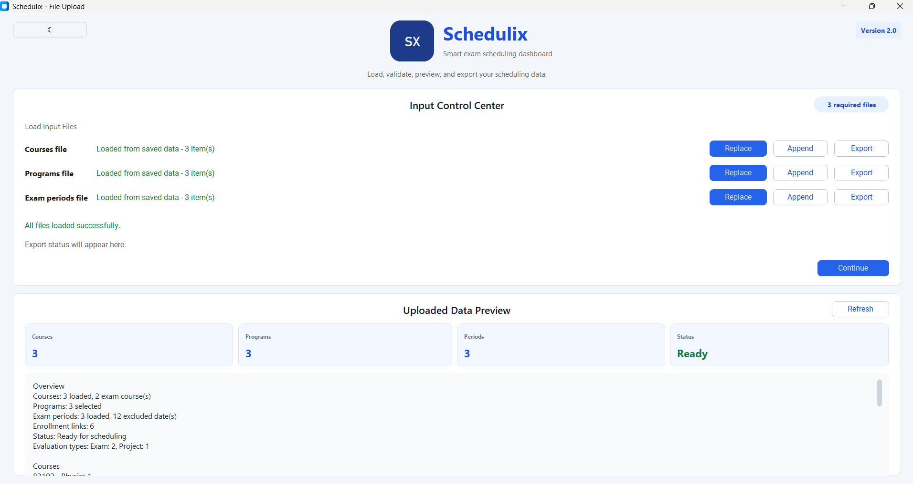
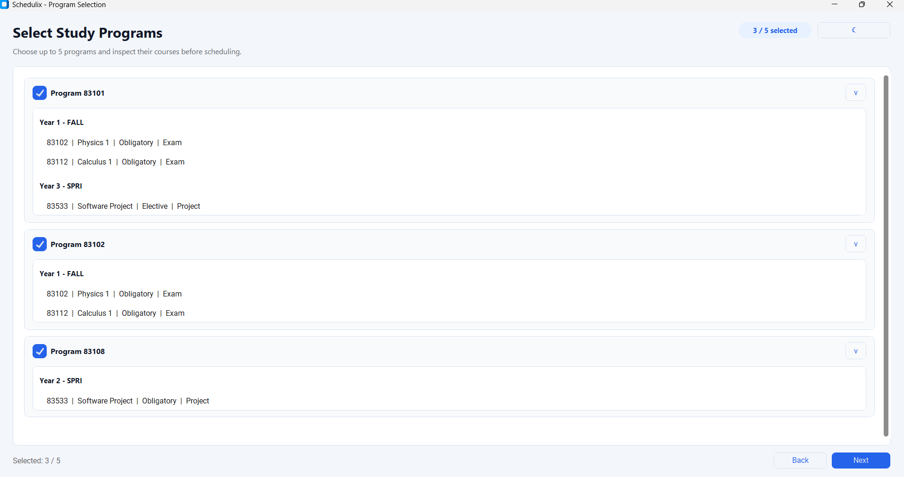
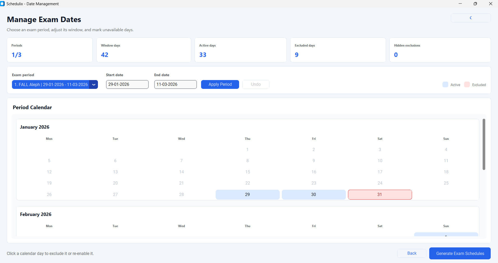
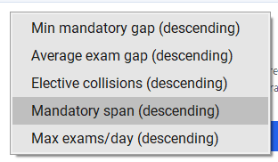
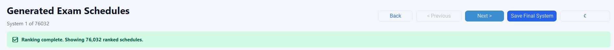

# Basic Course Example

## Purpose

This is the main normal-generation demo. It shows that Schedulix can generate
and browse a large valid schedule universe, then apply ranking explicitly as a
separate decision-support flow.

## Files

- `programs.txt`
- `courses.txt`
- `dates.txt`
- `settings.txt`

`settings.txt` disables threshold constraints for this demo so normal
generation exposes the full classic schedule universe. When the three input
files are selected from this folder, the GUI preloads `settings.txt`
automatically.

## GUI Flow

1. Open the GUI.
2. Upload/select this folder's `courses.txt`, `programs.txt`, and `dates.txt`.
3. Continue to program selection and confirm the selected programs.
4. Continue to scheduling settings and confirm threshold constraints are off.
5. Continue to date management.
6. Click `Generate Exam Schedules`.
7. Confirm the generated schedules screen shows about `76,032` schedules.
8. Add ranking criteria from the Ranking panel.
9. While ranking runs, browse the temporary Top 50 preview.
10. Click `Show Full Ranking` after ranking completes.

## Expected Results

- Normal generation shows all valid schedules, not Top 50.
- The counter should show `System 1 of 76032` or the current full generated
  count for this dataset.
- Explicit ranking shows a temporary Top 50 preview while ranking continues.
- `Show Full Ranking` switches to the full ranked result set.

## Screenshots

### Upload Files

### Select Programs

### Manage Dates

### Generated Schedules

### Ranking Criteria

### Live Top 50 Preview

### Full Ranking Complete

