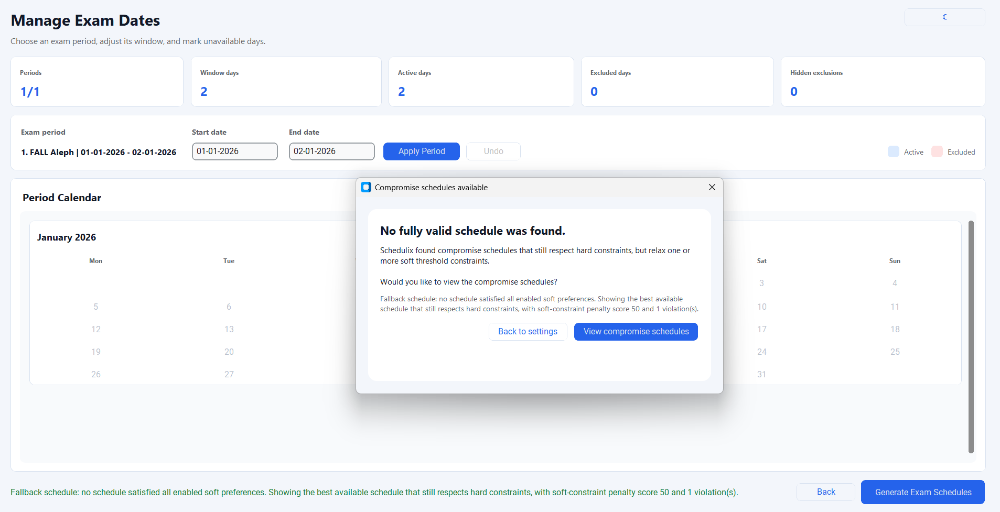

# Fallback Compromise Demo

## Purpose

This demo shows what Schedulix does when strict generation cannot find any
fully valid schedule under the enabled soft threshold constraints. Instead of
failing silently, the GUI offers a compromise schedule that still respects hard
constraints and clearly explains the soft-constraint violation.

## Files

- `programs.txt`
- `courses.txt`
- `dates.txt`
- `settings.txt`

`settings.txt` enables an impossible mandatory-gap threshold:
`mandatory_gap_days = on, 10`. When the three input files are selected from
this folder, the GUI preloads `settings.txt` automatically.

## Scenario

- Two mandatory courses must be scheduled.
- Only two dates are available: `01-01-2026` and `02-01-2026`.
- The mandatory gap threshold requires `10` days.
- A fully valid strict schedule is impossible because the dates are only one
  day apart.

## GUI Flow

1. Open the GUI.
2. Upload/select this folder's `courses.txt`, `programs.txt`, and `dates.txt`.
3. Confirm the settings screen shows mandatory gap enabled with value `10`.
4. Continue to date management.
5. Click `Generate Exam Schedules`.
6. Confirm the prompt says no fully valid schedule was found.
7. Click `View compromise schedules`.
8. Confirm the output shows `System 1 of 1 | Compromise schedule`.

## Expected Results

- Strict generation finds no fully valid schedule.
- The GUI offers compromise schedules.
- The output screen shows penalty `50`.
- Violation count is `1`.
- The violation explains that mandatory exams are only `1` day apart while the
  required minimum is `10`.
- Hard constraints are still respected; only soft threshold constraints are
  relaxed.

## Screenshots

### Compromise Prompt

### Compromise Output

