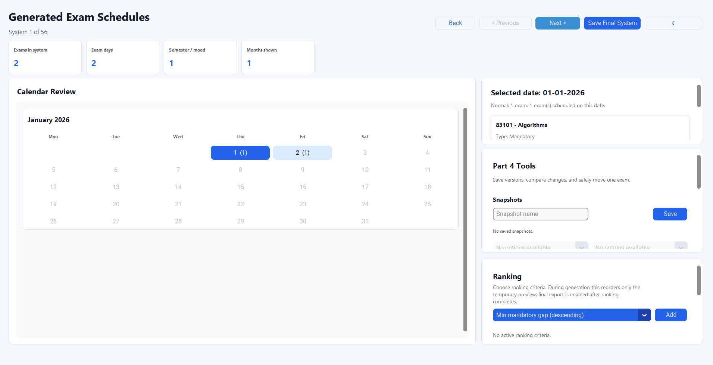
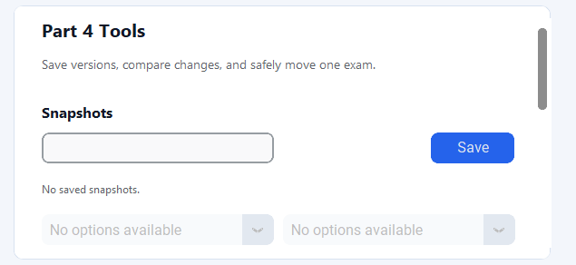
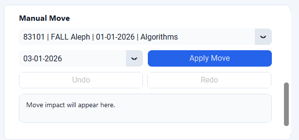
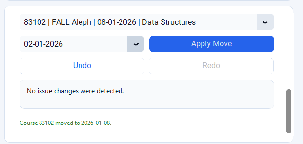
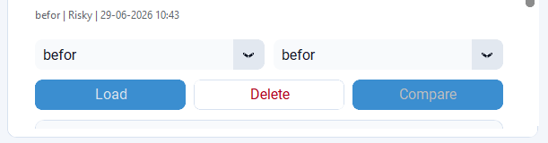
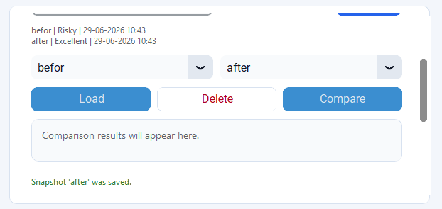

# Quality Snapshot Demo

## Purpose

This demo shows the Part 4 decision-support workflow from start to finish:
generate a small schedule set, save a baseline snapshot, manually move one exam,
save the improved version, and compare the two snapshots.

The point of the demo is to show that Schedulix is not only a schedule
generator. It also helps the user improve a generated schedule and explain that
improvement visually.

## Demo Files

- `programs.txt`
- `courses.txt`
- `dates.txt`
- `settings.txt`

`settings.txt` disables threshold constraints so the first generated schedule
can be hard-valid but low-quality. When the three input files are selected from
this folder, the GUI preloads `settings.txt` automatically.

## Expected Result

- Normal generation produces `56` schedules.
- `System 1` starts as `Risky`.
- The user saves this schedule as `before`.
- The user moves `83102 - Data Structures` from `02-01-2026` to `08-01-2026`.
- The schedule quality becomes `Excellent`.
- The user saves the improved schedule as `after`.
- Snapshot comparison shows `Risky` to `Excellent`.
- The comparison shows the moved exam and its before/after dates.
- Constraint penalty remains `0 -> 0` because threshold constraints are
  disabled for this demo.

## Step-by-Step GUI Flow

1. Open the GUI.
2. Upload/select this folder's `courses.txt`, `programs.txt`, and `dates.txt`.
3. Confirm the preloaded settings keep threshold constraints off.
4. Generate schedules.
5. Confirm `System 1` starts as `Risky`.
6. Save a snapshot named `before`.
7. In Part 4 Tools, move `83102 - Data Structures` from `02-01-2026` to
   `08-01-2026` for `FALL Aleph`.
8. Confirm the quality becomes `Excellent`.
9. Save a snapshot named `after`.
10. Compare `before` and `after`.

### 1. Generate the Demo Schedules

After generating, the screen should show `System 1 of 56`. This first schedule
is intentionally valid but low quality, so it is labeled `Risky`.

### 2. Save `before`

Save the initial schedule as `before`. This creates the baseline version that
will later be compared with the manually improved schedule.

### 3. Apply the Manual Move

Use the Part 4 manual move controls to move:

- Course: `83102 - Data Structures`
- Semester/moed: `FALL Aleph`
- Source date: `02-01-2026`
- Target date: `08-01-2026`

The calendar updates after the move so the user can see that the exam is now on
the new date.

### 4. Verify Quality Improvement and Save `after`

After the move, the schedule quality should become `Excellent`. Save this
improved version as `after`.

### 5. Select Snapshots to Compare

Choose `before` as the baseline and `after` as the modified schedule in the
comparison controls.

### 6. Compare Before and After

The comparison view shows the two saved versions side by side. This makes the
quality change visible before looking at the detailed moved-exam cards.

### 7. Explain the Improvement

The final comparison summary should show `Risky` to `Excellent`, while the
moved exam details show exactly which exam changed dates.

## Notes and Troubleshooting

- Use `System 1` for the live demo. The known move is designed around that
  generated schedule.
- If the quality does not become `Excellent`, confirm that the moved exam is
  `83102 - Data Structures` and that the target date is `08-01-2026`.
- If the comparison options are empty, make sure both snapshots were saved with
  the exact names `before` and `after`.
- The constraint penalty is expected to stay unchanged at `0 -> 0`; the visible
  improvement is the schedule quality change.
- This README intentionally uses only snapshot/manual-move/comparison
  screenshots. Fallback and ranking screenshots are documented in their own demo
  folders.
